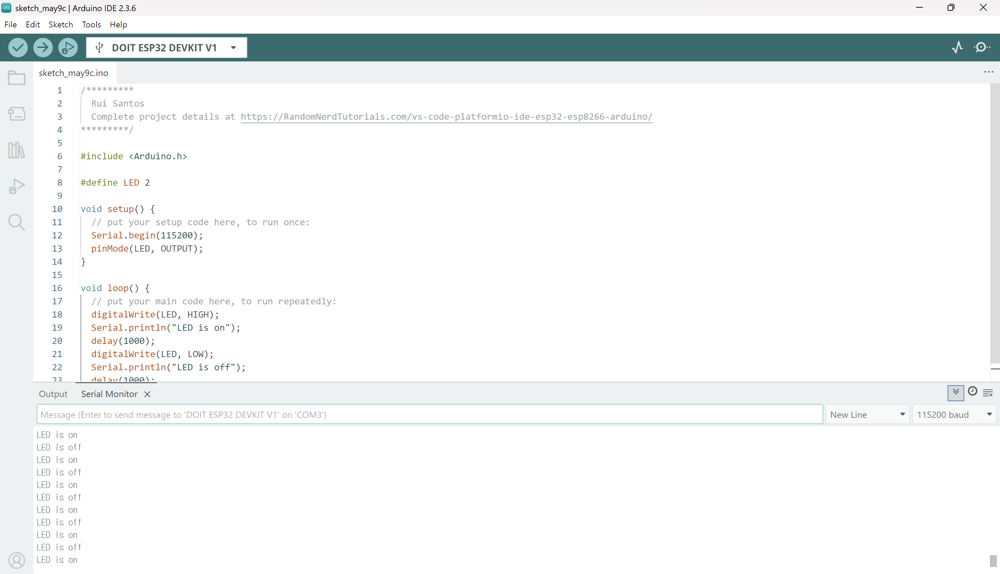

# IoT25-HW01
Assignment 1. Installing ESP32 in Arduino IDE 2.0

---

## IDE

---

## Source code
/*********
  Rui Santos
  Complete project details at https://RandomNerdTutorials.com/vs-code-platformio-ide-esp32-esp8266-arduino/
*********/

#include <Arduino.h>

#define LED 2

void setup() {
  // put your setup code here, to run once:
  Serial.begin(115200);
  pinMode(LED, OUTPUT);
}

void loop() {
  // put your main code here, to run repeatedly:
  digitalWrite(LED, HIGH);
  Serial.println("LED is on");
  delay(1000);
  digitalWrite(LED, LOW);
  Serial.println("LED is off");
  delay(1000);
}

## Video
(https://youtu.be/xpfyhg-kuWc?si=W06uHVeLY3pcUJju)
